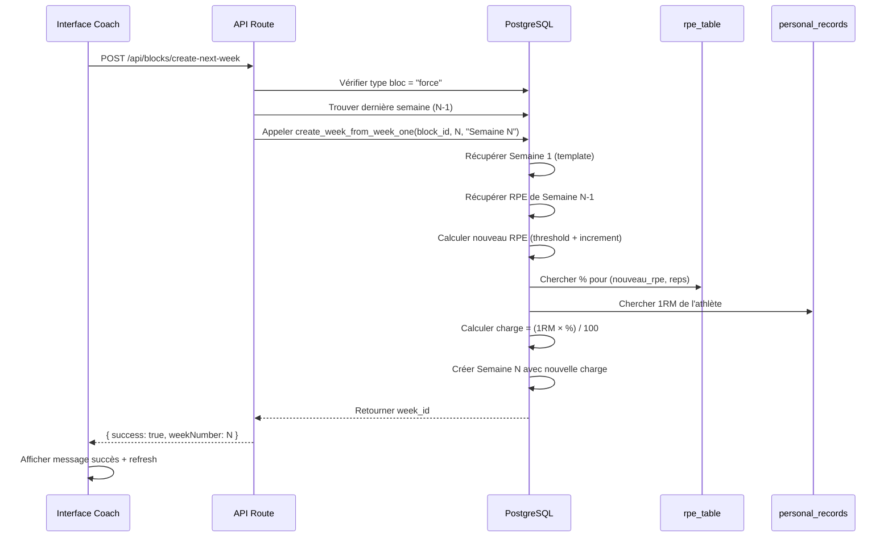

# 📋 Récapitulatif Complet - Auto-Incrément RPE avec Bouton UI

## 🎯 Objectif
Permettre la création automatique de semaines d'entraînement avec **incrément automatique du RPE** pour les blocs de force, directement depuis l'interface utilisateur via un bouton.

---

## ✅ Ce qui a été implémenté

### 1️⃣ **Base de données (PostgreSQL)**

#### Fichier : `supabase/add-rpe-increment-params.sql`
- Ajout de 3 colonnes à la table `training_blocks` :
  - `rpe_increment_low` : Incrément si RPE < seuil (défaut: 1.0)
  - `rpe_increment_high` : Incrément si RPE ≥ seuil (défaut: 0.5)
  - `rpe_threshold` : Seuil de décision (défaut: 6.0)

#### Fichier : `supabase/update-rpe-table.sql`
- **264 entrées** RPE complètes (RPE 0.0 à 12.5, reps 1-12)
- Données exactes fournies par l'utilisateur
- Format : `(rpe, reps, percentage)`

#### Fichier : `supabase/create-week-from-week-one-function.sql`
- Fonction PostgreSQL : `create_week_from_week_one(p_block_id, p_week_number, p_week_name)`
- **Logique** :
  1. Trouve la Semaine 1 comme template
  2. Récupère le RPE de la dernière semaine (N-1)
  3. Applique l'incrément selon le seuil :
     - Si `prev_rpe < threshold` → `new_rpe = prev_rpe + increment_low`
     - Sinon → `new_rpe = prev_rpe + increment_high`
  4. Cherche le nouveau pourcentage dans `rpe_table`
  5. Récupère le 1RM de l'athlète dans `personal_records`
  6. Calcule la charge : `weight = (1RM × percentage) / 100`
  7. Crée la nouvelle semaine avec toutes les séances et sets

---

### 2️⃣ **API Route (Next.js)**

#### Fichier : `src/app/api/blocks/create-next-week/route.ts`
- Endpoint POST : `/api/blocks/create-next-week`
- **Paramètres** : `{ blockId: string }`
- **Validations** :
  - Vérifie que le bloc est de type "force"
  - Vérifie que la Semaine 1 existe
  - Détecte automatiquement le dernier numéro de semaine
- **Traitement** :
  - Calcule le prochain numéro de semaine : `lastWeekNumber + 1`
  - Génère le nom automatiquement : "Semaine N"
  - Appelle la fonction SQL `create_week_from_week_one`
- **Réponse** : `{ success: true, weekNumber: N, weekId: "..." }`

---

### 3️⃣ **Interface Utilisateur (React/TypeScript)**

#### Fichier : `src/components/coach/BlockDetailView.tsx`
- **Nouveau bouton** : "Créer semaine suivante (auto RPE)" 📈
- **Position** : Entre "Ajouter une semaine" et "Supprimer le bloc"
- **Style** : Vert émeraude (indique action automatique)
- **États** :
  - Désactivé si aucune semaine n'existe
  - État de chargement pendant la création
- **Fonctionnalité** :
  - Appelle l'API `/api/blocks/create-next-week`
  - Affiche un message de succès/erreur
  - Rafraîchit automatiquement la page

---

### 4️⃣ **Types TypeScript**

#### Fichier : `src/lib/types.ts`
```typescript
export interface TrainingBlock {
  id: string;
  athlete_id: string;
  name: string;
  description: string | null;
  start_date: string | null;
  end_date: string | null;
  is_active: boolean;
  block_type: 'force' | 'general';
  rpe_increment_low: number;  // Défaut: 1.0
  rpe_increment_high: number; // Défaut: 0.5
  rpe_threshold: number;      // Défaut: 6.0
  created_at: string;
}
```

---

### 5️⃣ **Documentation**

| Fichier | Description |
|---------|-------------|
| `AUTO_RPE_INCREMENT.md` | Documentation technique complète |
| `RECAP_AUTO_RPE_INCREMENT.md` | Résumé de l'implémentation initiale |
| `GUIDE_AUTO_RPE.md` | Guide d'utilisation rapide |
| `GUIDE_TEST_AUTO_RPE.md` | Checklist de test avec scénarios |
| `RECAP_AUTO_RPE_COMPLETE.md` | Ce document |

---

## 🔧 Installation

### Étape 1 : Exécuter les scripts SQL (dans l'ordre)
```sql
-- 1. Ajouter les paramètres de configuration
\i supabase/add-rpe-increment-params.sql

-- 2. Mettre à jour la table RPE (264 entrées)
\i supabase/update-rpe-table.sql

-- 3. Créer la fonction PostgreSQL
\i supabase/create-week-from-week-one-function.sql
```

### Étape 2 : Vérifier l'installation
```sql
-- Vérifier les colonnes ajoutées
SELECT column_name, data_type, column_default
FROM information_schema.columns
WHERE table_name = 'training_blocks'
AND column_name LIKE 'rpe_%';

-- Vérifier la table RPE
SELECT COUNT(*) FROM rpe_table; -- Doit retourner 264

-- Vérifier la fonction
SELECT proname, prosrc 
FROM pg_proc 
WHERE proname = 'create_week_from_week_one';
```

---

## 🎮 Utilisation

### 1. Créer un bloc de force
```typescript
const newBlock = {
  name: "Cycle Force - Janvier 2024",
  block_type: "force", // Important !
  athlete_id: "...",
  // Les paramètres RPE sont définis par défaut :
  // rpe_increment_low: 1.0
  // rpe_increment_high: 0.5
  // rpe_threshold: 6.0
};
```

### 2. Créer la Semaine 1 manuellement
- Ajouter séances, exercices, séries
- Définir les RPE initiaux (ex: 7.0, 5.5, 8.5)

### 3. Cliquer sur le bouton "Créer semaine suivante (auto RPE)"
- Détecte automatiquement le dernier numéro
- Crée la semaine suivante
- Incrémente les RPE selon les règles
- Calcule les charges automatiquement
- Rafraîchit l'affichage

---

## 🧮 Exemple de calcul

### Configuration du bloc
```sql
rpe_increment_low = 1.0
rpe_increment_high = 0.5
rpe_threshold = 6.0
```

### Semaine 1 (manuelle)
| Exercice | RPE | Reps | % 1RM | 1RM | Charge |
|----------|-----|------|-------|-----|--------|
| Squat | 7.0 | 6 | 82% | 150kg | **123kg** |
| Bench | 5.5 | 8 | 75% | 110kg | **82.5kg** |

### Semaine 2 (auto-créée)
| Exercice | RPE précédent | Calcul | Nouveau RPE | % 1RM | Charge |
|----------|---------------|--------|-------------|-------|--------|
| Squat | 7.0 | 7.0 ≥ 6.0 → +0.5 | **7.5** | 85% | **127.5kg** |
| Bench | 5.5 | 5.5 < 6.0 → +1.0 | **6.5** | 79% | **86.9kg** |

### Semaine 3 (auto-créée)
| Exercice | RPE précédent | Calcul | Nouveau RPE | % 1RM | Charge |
|----------|---------------|--------|-------------|-------|--------|
| Squat | 7.5 | 7.5 ≥ 6.0 → +0.5 | **8.0** | 86% | **129kg** |
| Bench | 6.5 | 6.5 ≥ 6.0 → +0.5 | **7.0** | 82% | **90.2kg** |

---

## ⚙️ Configuration personnalisée

### Modifier les paramètres d'un bloc
```sql
UPDATE training_blocks
SET 
  rpe_increment_low = 0.5,   -- Incrément faible
  rpe_increment_high = 0.25, -- Incrément fort
  rpe_threshold = 7.0        -- Nouveau seuil
WHERE id = 'BLOCK_ID';
```

### Créer un bloc avec config custom
```typescript
const customBlock = {
  name: "Cycle Force Avancé",
  block_type: "force",
  athlete_id: "...",
  rpe_increment_low: 0.5,   // Progression plus douce
  rpe_increment_high: 0.25, // Progression très fine
  rpe_threshold: 7.5,       // Seuil plus élevé
};
```

---

## 🐛 Gestion des erreurs

### Erreurs côté API
| Erreur | Cause | Solution |
|--------|-------|----------|
| "blockId est requis" | Paramètre manquant | Vérifier l'appel API |
| "Bloc introuvable" | ID invalide | Vérifier l'ID du bloc |
| "Ce bloc n'est pas de type 'force'" | Mauvais type | Utiliser la duplication manuelle |
| "La semaine 1 n'existe pas" | Pas de template | Créer la Semaine 1 d'abord |
| "Erreur lors de la création" | Erreur SQL | Vérifier les logs Supabase |

### Erreurs côté UI
| Comportement | Cause | Solution |
|--------------|-------|----------|
| Bouton désactivé | Aucune semaine | Créer la Semaine 1 |
| Bouton "Création..." | En cours | Attendre la fin |
| Message d'erreur | Échec API | Voir le message détaillé |

---

## 📊 Flux de données complet



---

## 🎯 Points clés de l'implémentation

### ✅ Ce qui fonctionne
- ✅ Détection automatique du dernier numéro de semaine
- ✅ Incrément RPE basé sur seuil configurable
- ✅ Calcul automatique des charges à partir de la table RPE
- ✅ Utilisation des 1RM de l'athlète
- ✅ Copie de la structure complète (séances, exercices, sets)
- ✅ Interface utilisateur intuitive avec feedback
- ✅ Gestion d'erreurs complète
- ✅ Support RPE jusqu'à 12.5

### ⚠️ Limitations connues
- Fonctionne uniquement pour les blocs de type "force"
- Nécessite que la Semaine 1 existe comme template
- Utilise toujours la Semaine 1 comme base (pas la semaine précédente)
- Les charges ne sont calculées que si un 1RM existe
- Les paramètres d'incrément sont globaux au bloc (pas par exercice)

### 🔮 Améliorations possibles
- Permettre de choisir la semaine template (pas forcément la 1)
- Ajouter des paramètres d'incrément par exercice
- Gérer les blocs "general" avec une autre logique
- Ajouter un historique des incréments
- Permettre de modifier le RPE après auto-création
- Ajouter des graphiques de progression RPE/charge

---

## 🧪 Tests recommandés

### Test 1 : Scénario nominal
1. Créer bloc "force" avec paramètres par défaut
2. Créer Semaine 1 avec RPE variés (5.0, 7.0, 9.0)
3. Cliquer sur bouton auto
4. Vérifier incréments : 5.0→6.0 (+1.0), 7.0→7.5 (+0.5), 9.0→9.5 (+0.5)

### Test 2 : Configuration personnalisée
1. Modifier `rpe_increment_low = 0.5` et `threshold = 7.0`
2. Créer semaines avec RPE 6.5 et 7.5
3. Vérifier : 6.5→7.0 (+0.5), 7.5→8.0 (+0.5)

### Test 3 : Cas limites
1. RPE = 12.5 (maximum) → Doit rester 12.5
2. Pas de 1RM → Charge NULL ou 0
3. Pas de Semaine 1 → Message d'erreur clair

### Test 4 : Performance
1. Bloc avec 10+ semaines
2. Semaines avec 5+ séances
3. Séances avec 20+ sets
4. Vérifier temps de création < 3 secondes

---

## 📝 Checklist de déploiement

- [ ] Scripts SQL exécutés sur Supabase Production
- [ ] Fonction PostgreSQL créée et testée
- [ ] Table RPE contient 264 entrées
- [ ] API route accessible et fonctionnelle
- [ ] Bouton UI visible dans BlockDetailView
- [ ] Tests manuels passés avec succès
- [ ] Documentation mise à jour
- [ ] Logs d'erreur vérifiés
- [ ] Performance mesurée et acceptable
- [ ] Formation des coachs utilisateurs

---

## 📚 Ressources

### Fichiers SQL
- `supabase/add-rpe-increment-params.sql` - Configuration RPE
- `supabase/update-rpe-table.sql` - Table RPE complète (264 entrées)
- `supabase/create-week-from-week-one-function.sql` - Fonction auto-création

### Fichiers TypeScript
- `src/app/api/blocks/create-next-week/route.ts` - API endpoint
- `src/components/coach/BlockDetailView.tsx` - Interface utilisateur
- `src/lib/types.ts` - Définitions de types

### Documentation
- `AUTO_RPE_INCREMENT.md` - Documentation technique
- `GUIDE_AUTO_RPE.md` - Guide utilisateur
- `GUIDE_TEST_AUTO_RPE.md` - Guide de test
- `RECAP_AUTO_RPE_COMPLETE.md` - Ce document

---

## 🤝 Support

Pour toute question ou problème :
1. Vérifier les logs dans la console navigateur
2. Vérifier les logs Supabase (onglet Logs)
3. Consulter `GUIDE_TEST_AUTO_RPE.md` pour les scénarios de test
4. Vérifier que les 3 scripts SQL sont bien exécutés

---

**Date de création** : Janvier 2024  
**Version** : 1.0.0  
**Statut** : ✅ Prêt pour utilisation
